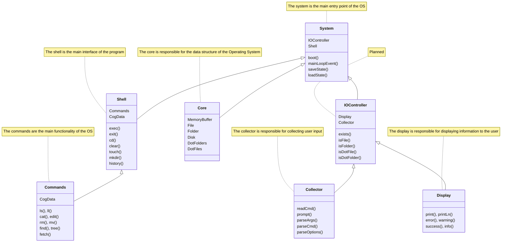

# TermOS

## Arch

Architectural overview of the project using mermaid class diagram

## Core

- [x] Memory Buffer
- [x] File
- [x] Folder
- [x] Disk
- [x] DotFolders
- [x] DotFiles
- [x] System
- [x] Shell

## Shell

- [x] Implement `fetch`
- [x] Implement `mv` command
- [x] Implement `history` command
- [x] Implement `find` command

## System

- [x] Implement `io` for system
- [x] Implement state saving & loading
- [x] Override KeyboardInterrupt

## IOController

- [x] Implement `IOController` for system
- [x] Implement `Collector` for system
- [x] Implement `display` for system

## TODO

- [ ] Implement nested `cd` command (path)
- [ ] Implement `cp` command
- [ ] Recursive tree using `rich` (hide dotfiles & dotfolders)
- [x] Implement `jmp` command
- [x] Implement `addr` command
- [x] Implement option parsing & handling
- [x] Handle args within the imlementation of each method (within the controller object)
- [x] Change folder architecture
- [x] Find a platform agnostic alternitive to `readline`
- [x] Prettifying using Rich
- [x] Move booting and mainLoopEvents to `system`
- [x] Implement input with prefill
- [x] Break down `shell` into smaller components i.e. `shell`, `shellCommands` (bin, interfaces, shell.exec) that can be "attached"
- [x] Outsourced `tree` to `shell`
- [x] Prevent files or folders from having the same name
- [x] Disable `find` on dotfiles
- [x] DotFile & File counting
- [x] Guard statement for Null args
- [x] HOT FIX: cd to root directory
- [x] HOT FIX: cat not working on Files
- [x] HOT FIX: edit not working on Files
- [x] HOT FIX: rm not working on Files
- [x] Unknown command None bug
- [x] Refactoring shell commands implementations
- [x] Implement command line arguments parsing for shell commands
